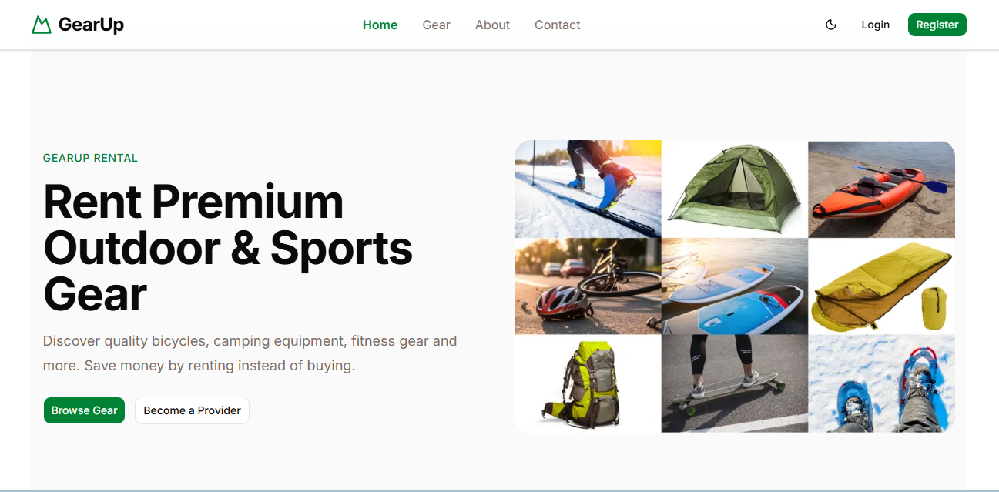
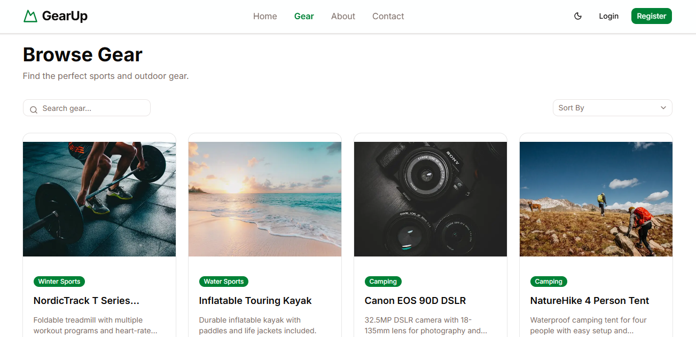
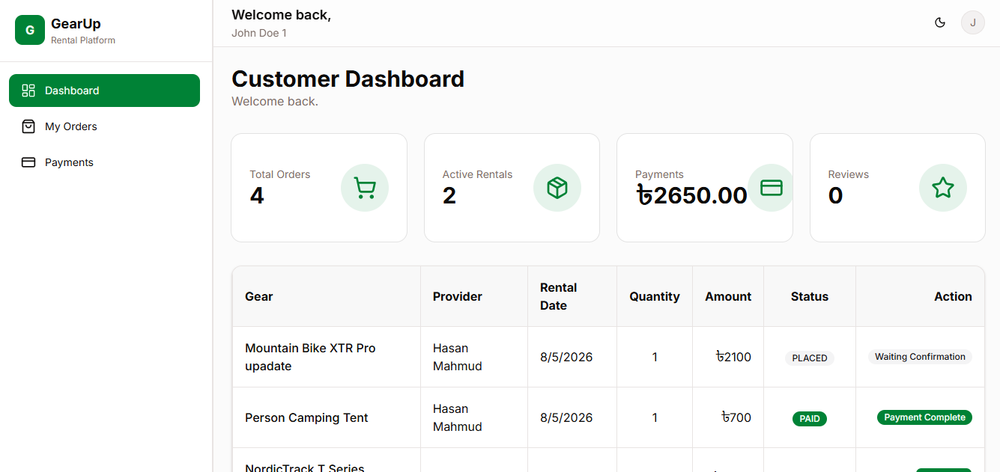
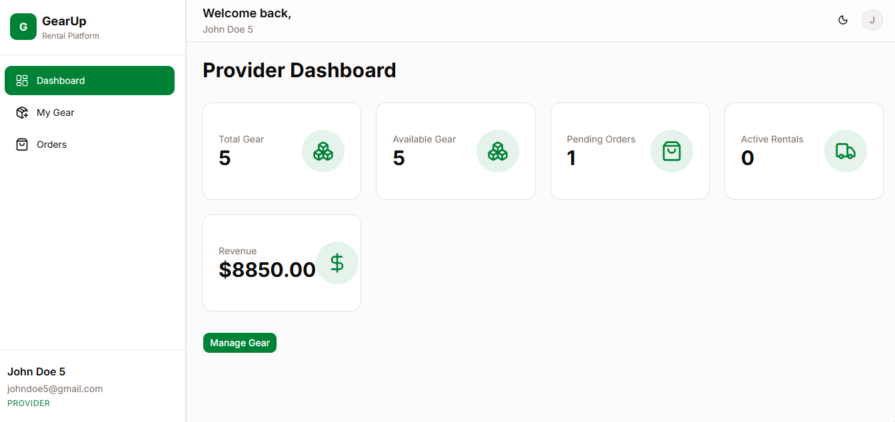
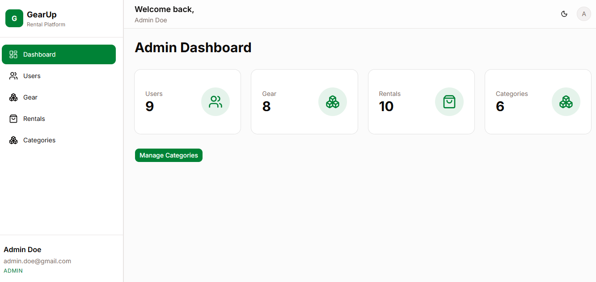

# 🚀 GearUp - Outdoor Gear Rental Platform

<p align="center">


</p>

A modern **Full Stack Outdoor Gear Rental Platform** where customers can rent outdoor equipment, providers manage their inventory, and administrators oversee the entire system.

Built using **Next.js App Router**, **Express.js**, **TypeScript**, **Prisma ORM**, **PostgreSQL**, and **Stripe Checkout**.

---

# 🌐 Live Demo

| Project     | Link                                    |
| ----------- | --------------------------------------- |
| Frontend    | https://gearup-frontend-rose.vercel.app |
| Backend API | https://gear-up-backend-jet.vercel.app  |

---

<!-- # 🎥 Demo Video

https://your-demo-video-link

--- -->

# 📸 Screenshots

## Home Page

<!-- > Add screenshot -->



<!-- ```text
public/screenshots/home.png
``` -->

---

## Gear Listing



<!-- ```text
public/screenshots/gear.png
``` -->

---

## Customer Dashboard



```text
public/screenshots/customer-dashboard.png
```

---

## Provider Dashboard



<!-- ```text
public/screenshots/provider-dashboard.png
``` -->

---

## Admin Dashboard



<!-- ```text
public/screenshots/admin-dashboard.png
``` -->

---

# ✨ Features

## 🔓 Authentication

- JWT Authentication
- Secure Login
- Secure Registration
- HTTP Only Cookie Authentication
- Protected Routes
- Role Based Authorization
- Persistent Login
- Logout

---

## 👤 Customer Features

- Browse available gear
- Search gear
- Filter by category
- View gear details
- Place rental orders
- Stripe Checkout payment
- View payment history
- View rental history
- Leave reviews
- Customer dashboard

---

## 🚚 Provider Features

- Provider Dashboard
- Add new gear
- Update gear
- Delete gear
- Inventory management
- View rental orders
- Update rental status

---

## 👨‍💼 Admin Features

- Admin Dashboard
- Manage users
- Update user status
- Manage categories
- View rental orders
- Monitor platform

---

## 🌍 Public Pages

- Home
- About
- Contact
- Browse Gear
- Gear Details

---

# 🛠 Tech Stack

## Frontend

- Next.js 16 (App Router)
- React 19
- TypeScript
- Tailwind CSS
- Shadcn UI
- Lucide React
- Server Actions

---

## Backend

- Node.js
- Express.js
- TypeScript
- Prisma ORM

---

## Database

- PostgreSQL

---

## Authentication

- JWT
- HTTP Only Cookies

---

## Payment

- Stripe Checkout
- Stripe Webhook

---

## Validation

- Zod

---

## Deployment

- Vercel
- Prisma PostgreSQL

---

# 📦 Main Packages

## Frontend

```json
{
  "class-variance-authority": "^0.7.1",
  "clsx": "^2.1.1",
  "jwt-decode": "^4.0.0",
  "lucide-react": "^1.27.0",
  "next": "16.2.12",
  "next-themes": "^0.4.6",
  "radix-ui": "^1.6.7",
  "react": "19.2.4",
  "react-dom": "19.2.4",
  "react-hook-form": "^7.83.0",
  "shadcn": "^4.16.0",
  "sonner": "^2.0.7",
  "tailwind-merge": "^3.6.0",
  "tw-animate-css": "^1.4.0",
  "zod": "^4.4.3"
}
```

---

## Backend

```json
{
  "@prisma/adapter-pg": "^7.8.0",
  "@prisma/client": "^7.8.0",
  "bcrypt": "^6.0.0",
  "cookie-parser": "^1.4.7",
  "cors": "^2.8.6",
  "dotenv": "^17.4.2",
  "express": "^5.2.1",
  "http-status": "^2.1.0",
  "jsonwebtoken": "^9.0.3",
  "pg": "^8.22.0",
  "stripe": "^22.3.1",
  "tsup": "^8.5.1",
  "zod": "^4.4.3"
}
```

<!-- ---

# 📂 Project Structure

```text
gearup/

│
├── gearup-frontend/
│   ├── app/
│   ├── components/
│   ├── services/
│   ├── actions/
│   ├── hooks/
│   ├── lib/
│   ├── types/
│   ├── constants/
│   ├── public/
│   └── package.json
│
├── gearup-backend/
│   ├── src/
│   │   ├── modules/
│   │   ├── routes/
│   │   ├── middlewares/
│   │   ├── config/
│   │   ├── utils/
│   │   └── app.ts
│   │
│   ├── prisma/
│   ├── generated/
│   └── package.json
│
└── README.md
``` -->

---

# ⚙ Environment Variables

## Frontend

Create a `.env.local`

```env
BACKEND_API_URL=https://your-backend.vercel.app

NEXT_PUBLIC_APP_URL=https://your-frontend.vercel.app
```

---

## Backend

Create a `.env`

```env
NODE_ENV=production

PORT=5000

DATABASE_URL=

JWT_ACCESS_SECRET=

JWT_REFRESH_SECRET=

JWT_ACCESS_EXPIRES_IN=1d

JWT_REFRESH_EXPIRES_IN=30d

BCRYPT_SALT_ROUNDS=10

STRIPE_SECRET_KEY=

STRIPE_WEBHOOK_SECRET=

APP_URL=https://your-frontend.vercel.app
```

---

# 🚀 Local Installation

## Clone Repository

```bash
git clone https://github.com/khairul-01/GearUp-Frontend.git

cd GearUp-Frontend
```

---

## Backend

```bash
git clone https://github.com/khairul-01/GearUp-Backend.git

cd GearUp-Backend

pnpm install
```

Generate Prisma Client

```bash
pnpm prisma generate
```

Run Migrations

```bash
pnpm prisma migrate dev
```

Start Development Server

```bash
pnpm dev
```

---

## Frontend

```bash
cd GearUp-Frontend

pnpm install

pnpm dev
```

---

# 🌐 Open Application

Frontend

```text
http://localhost:3000
```

Backend

```text
http://localhost:5000
```

---

# 👥 User Roles

| Role     | Permissions                       |
| -------- | --------------------------------- |
| Customer | Rent Gear, Payment, Reviews       |
| Provider | Manage Gear, Manage Orders        |
| Admin    | Manage Users, Categories, Rentals |

---

# ⭐ Highlights

- Full Stack TypeScript Application
- Responsive Design
- Secure Authentication
- Stripe Payment Integration
- Prisma ORM
- PostgreSQL
- Server Components
- Server Actions
- REST API
- Zod Validation
- Role Based Authorization
- Modern UI with Shadcn
- Production Ready Architecture

---

# 🔄 Application Workflow

```text
                  Register / Login
                         │
                         ▼
                JWT Authentication
                         │
                         ▼
                  Role Authorization
                         │
      ┌──────────────────┼──────────────────┐
      ▼                  ▼                  ▼
  Customer           Provider            Admin
      │                  │                  │
      ▼                  ▼                  ▼
 Browse Gear        Manage Gear       Manage Users
      │             View Orders       Manage Categories
      ▼                  │                  │
 Place Rental            ▼                  ▼
      │          Update Rental Status  Monitor Platform
      ▼
 Provider Confirms
      ▼
 Stripe Checkout
      ▼
 Stripe Webhook
      ▼
 Payment Completed
      ▼
 Rental Returned
      ▼
 Customer Review
```

---

# 💳 Rental Status Flow

```text
PLACED
   │
   ▼
CONFIRMED
   │
   ▼
PAID
   │
   ▼
RETURNED
```

---

# 💰 Payment Flow

```text
Customer
   │
   ▼
Create Rental Order
   │
   ▼
Provider Confirms Order
   │
   ▼
Stripe Checkout Session
   │
   ▼
Customer Completes Payment
   │
   ▼
Stripe Webhook
   │
   ▼
Payment Status → COMPLETED
Rental Status → PAID
Stock Updated
```

---

# 🔐 Authentication Flow

```text
Login
   │
   ▼
Generate JWT
   │
   ▼
Store Token in HTTP Only Cookie
   │
   ▼
Protected Route
   │
   ▼
Verify JWT
   │
   ▼
Authorize User Role
```

---

# 📡 Main API Endpoints

## Authentication

```http
POST   /api/auth/register
POST   /api/auth/login
GET    /api/auth/me
```

## Public

```http
GET    /api/gear
GET    /api/gear/:id
GET    /api/categories
```

## Customer

```http
POST   /api/rentals
GET    /api/rentals
GET    /api/rentals/:id
POST   /api/payments/create
```

## Provider

```http
POST   /api/provider/gear
PATCH  /api/provider/gear/:id
DELETE /api/provider/gear/:id
GET    /api/provider/orders
PATCH  /api/provider/orders/:id
```

## Admin

```http
GET    /api/admin/users
PATCH  /api/admin/users/:id
POST   /api/admin/categories
GET    /api/admin/rentals
```

---

# 🧪 Test Accounts

| Role     | Email               | Password     |
| -------- | ------------------- | ------------ |
| Admin    | your_admin@mail.com | **\*\*\*\*** |
| Provider | provider@mail.com   | **\*\*\*\*** |
| Customer | customer@mail.com   | **\*\*\*\*** |

---

# 🚀 Deployment

## Frontend

- Vercel

## Backend

- Vercel

## Database

- PostgreSQL

## Payment

- Stripe Checkout + Stripe Webhook

---

# 📈 Future Improvements

- Cloudinary image upload
- Email notifications
- Wishlist
- Coupons & Discounts
- Analytics Dashboard
- Provider Reports
- Admin Reports
- Multi-language Support
- PWA
- Real-time Notifications

---

# 🏆 Learning Outcomes

This project demonstrates practical experience with:

- Next.js App Router
- React Server Components
- Server Actions
- Express.js REST API
- TypeScript
- Prisma ORM
- PostgreSQL
- JWT Authentication
- Stripe Payment Integration
- Zod Validation
- Role-Based Authorization
- Responsive UI Design
- Error Handling
- API Integration

---

# 🤝 Contributing

Contributions are welcome!

1. Fork the repository.
2. Create a feature branch.
3. Commit your changes.
4. Push to your branch.
5. Open a Pull Request.

---

# 👨‍💻 Author

**Khairul Alam**

- GitHub: https://github.com/khairul-01
- LinkedIn: https://linkedin.com/in/khairul01
- Email: khairul431743@gmail.com

---

<!-- # 📄 License

This project is licensed under the **MIT License**.

--- -->

## ⭐ Support

If you found this project helpful, please consider giving it a ⭐ on GitHub.

It helps others discover the project and motivates further development.

---

**Thank you for visiting GearUp! 🚀**
